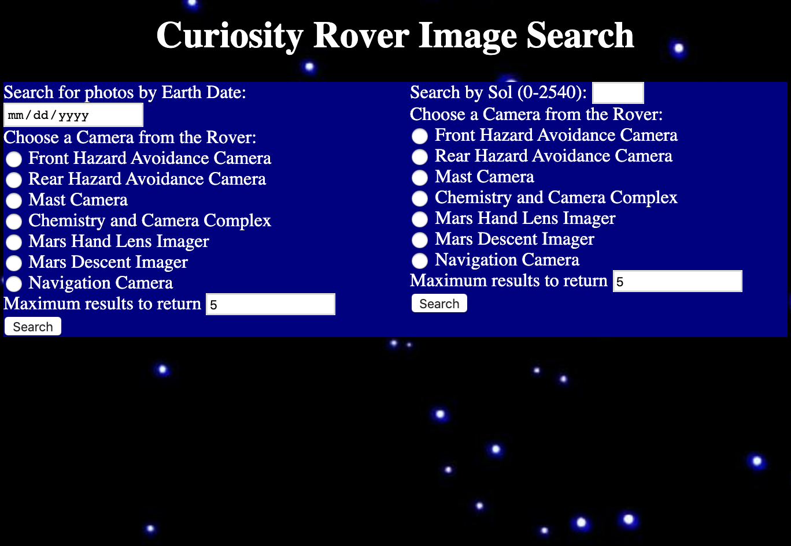

<h1>Curiosity Rover Image Center</h1>

 Click <a href="https://vincentdewitt.github.io/RoverCamProj/">here</a>  to view the live app

Screen shot of landing page

This app allows the user to look at diffrent photographs the the Curiosity took during its long journey on mars. The user is able to look at pictures that were taken at diffrent dates in its mission as well as through the diffrent camera arrays that are attached to the rover. The user has the possibility of searching using standard earth days or Sol's (which is the term for the typical Martian Day).
 